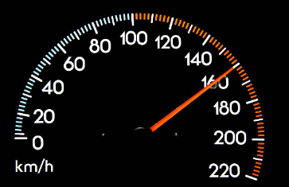

# Speed & Velocity

|         | Speed | Velocity |
| ------- | ----- | -------- |
| symbol  | /     | $\vec v$ |
| vector? | no    | yes      |

There are two kinds of velocity:

### Average velocity
Average velocity considers the **whole motion**.

$average\ \vec v = \dfrac{\vec s}{t}$

$\vec s$ is the displacement, $t$ is the time taken, **for the whole motion**

**Remark**
Even if the motion is very unusual / uneven, we still only take the start and end points in consideration.

### Instantaneous velocity
Instantaneous velocity is the velocity of an object at ONE instant.

> But wait, isn't velocity displacement over time? How can it be in one instant?

This is an example of instantaneous velocity: a speed-o-meter of a car

How is instantaneous velocity measured? It is actually just the average velocity of a very very small duration!
