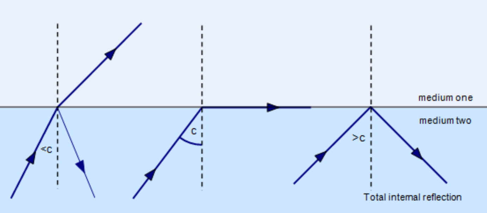

# Total Internal Reflection

Total internal reflection (TIR) occurs if:
1. light travels from an **optically denser** medium to an **optically less dense** medium
2. angle of incidence > critical angle ($i > C$)

---

### Critical angle $C$

Critical angle is the angle of incidence that causes light to refract **along the boundary of the two medium**

|                        | Figure 1 | Figure 2    | Figure 3 |
| ---------------------- | -------- | ----------- | -------- |
| angle of incidence $i$ | $i < C$  | $i = C$     | $i > C$  |
| TIR occurs?            | no       | just occurs | occurs   |

Applying General Snell's Law on figure 2, we have:

$$C = sin^{-1}(\dfrac{n_{to}}{n_{from}})$$
where $n_{to} < n_{from}$ (If you don't know why, refer to the first condition for TIR)

See the math

$$
\begin{align}
n_{from} \cdot sinC & = n_{to} \cdot sin90\degree \\
n_{from} \cdot sinC & = n_{to} \ \ \ \ \ \ \ \ \ \ \ \ \ (sin90\degree = 1) \\
sinC & = \dfrac{n_{to}}{n_{from}} \\
C & = sin^{-1}(\dfrac{n_{to}}{n_{from}})
\end{align}
$$

### Relation between $C$ and $n$

Situation: a light ray is going from medium 1 to medium 2, where $n_1 > n_2$

| If ...                     | $n_1$ increases                                                                                                                                  | $n_2$ increases                                                                                                                                  |
| -------------------------- | ------------------------------------------------------------------------------------------------------------------------------------------------ | ------------------------------------------------------------------------------------------------------------------------------------------------ |
| **Then ...**               | $C$ decreases                                                                                                                                    | $C$ increases                                                                                                                                    |
| **Feel The Physics** | light compared to original: - becomes much faster in medium 2 - bends away from normal more - easier to TIR $\therefore C$ decreases | light compared to original: - becomes less faster in medium 2 - bends away from normal less - harder to TIR $\therefore C$ increases |

Actually, we can use this equation for comparing changes
$$C \approx \dfrac{n_{to}}{n_{from}}$$
**This equation is NOT correct, it only lets u see how C changes with both n**

